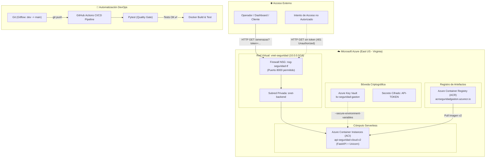

# 🛡️ Cloud Threat Sentinel API
### Arquitectura Cloud Empresarial con Microsoft Azure, Terraform, Docker y GitHub Actions


---

## 📌 Descripción General del Proyecto

**Cloud Threat Sentinel** es una solución integral de ciberseguridad y observabilidad diseñada bajo estándares empresariales de arquitectura en la nube y cultura DevOps. 

El sistema monitorea y analiza eventos de autenticación en servidores Linux (`auth.log`), detecta intentos de intrusión por fuerza bruta, geolocaliza las direcciones IP atacantes en tiempo real mediante consumo de APIs REST externas y sirve un tablero de inteligencia de amenazas estructurado en formato JSON a través de una API REST de alto rendimiento (FastAPI).

Toda la infraestructura está provisionada de manera **declarativa con Terraform**, asegurada con **Azure Key Vault** bajo el modelo de **Zero-Trust**, empaquetada en **contenedores Docker** y auditada por un pipeline automatizado de **CI/CD con GitHub Actions**.

---

## 🏛️ Diagrama de Arquitectura Cloud



---

## 🔐 Principios de Seguridad y Blindaje Corporativo (Zero-Trust)

1. **Gestión Centralizada de Secretos (Azure Key Vault):** 
   * Ningún secreto, token o contraseña se almacena en el código fuente de Python ni en repositorios de Git.
   * Separación estricta entre el **Plano de Control** (administración de infraestructura) y el **Plano de Datos** (acceso a secretos) mediante **Azure RBAC** (`Key Vault Secrets Officer`).
2. **Variables de Entorno Seguras (`--secure-environment-variables`):** 
   * En Azure Container Instances, los secretos se inyectan cifrados directamente en la memoria RAM del contenedor en tiempo de ejecución. Cualquier auditoría o inspección (`az container show`) devuelve el valor enmascarado como `null`, impidiendo fugas de credenciales en logs.
3. **Control de Acceso en API (FastAPI Security):** 
   * El endpoint sensible `/amenazas` exige validación criptográfica mediante Headers HTTP personalizados (`X-API-Token`) o parámetros seguros de consulta (`?token=...`), bloqueando intrusiones anónimas con código de estado `HTTP 401 Unauthorized`.
4. **Hardening de Permisos en Linux:** 
   * Scripts de automatización y lectura de logs protegidos con permisos numéricos estrictos (`chmod 500`).

---

## 🛠️ Stack Tecnológico

| Componente | Tecnología | Propósito |
| :--- | :--- | :--- |
| **Nube Pública** | Microsoft Azure | Plataforma integral de nube (East US) |
| **IaC Declarativo** | Terraform (HCL) | Aprovisionamiento automatizado y versionado de infraestructura |
| **IaC Imperativo** | Azure CLI / Bash | Automatización de ciclo de vida rápido y scripts FinOps |
| **Contenedores** | Docker & Docker Compose | Empaquetado inmutable multi-capa y portabilidad de microservicios |
| **Registro Cloud** | Azure Container Registry (ACR) | Almacenamiento seguro y privado de imágenes de contenedor |
| **Cómputo Serverless** | Azure Container Instances (ACI) | Ejecución elástica de contenedores en la nube sin administrar VMs |
| **Secretos y Criptografía** | Azure Key Vault | Custodia segura de credenciales respaldada por hardware |
| **CI/CD Pipeline** | GitHub Actions | Automatización de pruebas unitarias, Quality Gates y builds |
| **Pruebas Automatizadas** | Pytest & FastAPI TestClient | Suite de pruebas de regresión y auditoría de seguridad |
| **Backend & API** | Python 3.12 / FastAPI / Uvicorn | Procesamiento asíncrono y documentación Swagger UI autogenerada |
| **Control de Versiones** | Git (Gitflow) | Ramas `main` (producción) y `dev` (desarrollo activo) |

---

## 🚀 Despliegue y Ejecución

### 1. Clonar el repositorio
```bash
git clone https://github.com/tu-usuario/cloud-threat-sentinel.git
cd cloud-threat-sentinel
```

### 2. Ejecución Local con Docker Compose
```bash
# Construir y levantar el contenedor en segundo plano
docker compose up -d

# Consultar documentación interactiva Swagger
# Abrir en el navegador: http://localhost:8000/docs
```

### 3. Ejecución de la Suite de Pruebas Automatizadas (Pytest)
```bash
# Activar entorno virtual
source venv/bin/activate

# Ejecutar tests de seguridad y cobertura
pytest -v test_api_seguridad.py
```

### 4. Aprovisionamiento con Terraform
```bash
cd terraform

# Inicializar proveedores
terraform init

# Simular cambios (Dry-run)
terraform plan

# Aplicar infraestructura en Azure
terraform apply -auto-approve

# Destrucción controlada (FinOps)
terraform destroy -auto-approve
```

---

## 👨‍💻 Autor

* **Gastón Chacana** — *Cloud & DevOps Engineer*
* Enfoque: Microsoft Azure, Infraestructura como Código (Terraform), Docker, CI/CD y Ciberseguridad.
